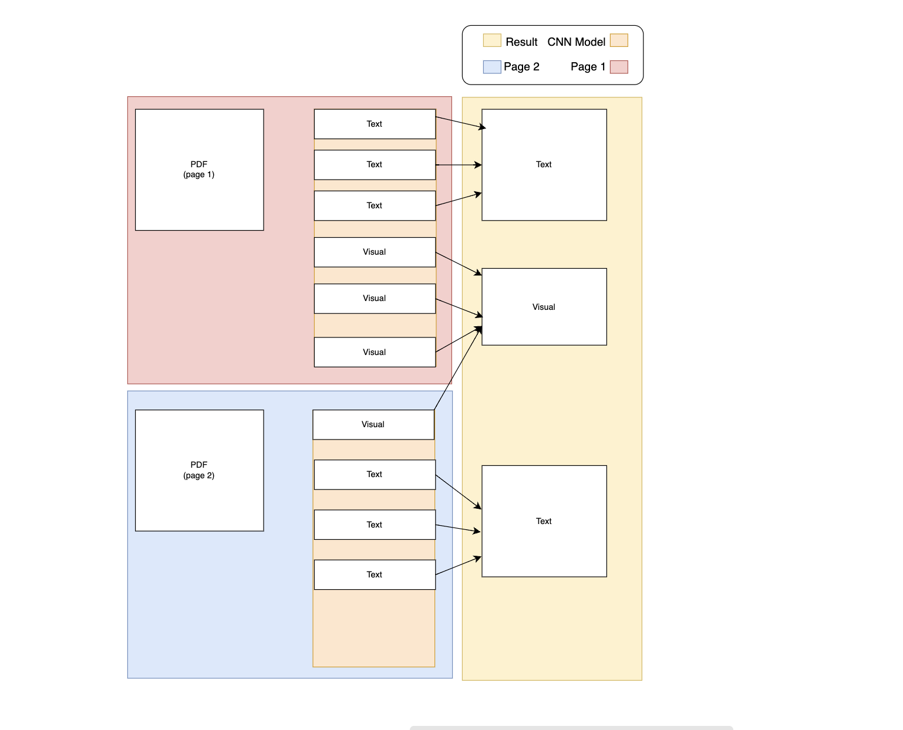

# contextual-extractor

### Idea

Create a formula able to perfectly deconstruct a paper into its varied components and create a optimized way for llms to digest and depict what occurs within graphs and visual representations such as charts and tables.

### Why

When gathering information from the web for the purposes of creating an agent we need to scrape a lot of data. A huge part of the web is the visual data which provides a large amount of context. We cant use OCR as we are just gathering the text from the image and not truly understand what is occuring inside of the image. How do we combat this?

We have access to llms now that are capable of understanding images but we need to understand what the best way to feed this data to an llm is.

### Solution

Following these steps we can create accurate descriptions of images and allow for automation within our agent, saving time and resources.
1. Create slices of images that contain everything, the text and the visual data.
2. Catagorize the slices into relevant groups, such as text or visual.
3. Reconstruct the slices in order to create images that properly sort out text from visual data.
4. Decide from a monodirectional or bidirectional approach to feeding in the context into the LLM and providing the image as visual data.
5. The LLM in theory will be better able to dipict what is occuring in the image. Providing a more accurate description that can be used in RAG.

What makes it difficult to just extract iamges from papers or web pages?

1. Images can be uploaded in various different formats
2. There is no clear way to know what is a image and what is text
3. Graphs and tables which contain lots of text can be misinterpreted as just text instead of visual data

This provides a much more coherent way to extract visuals from a page.

### The process (simplified)
1. ~~Train a CNN model to classify the slices as text or visual~~ Originally I was training a model but after testing and seeing how much better it was to just fine tune the MobileNetV2 model I decided to change my approach
2. Slice a pdf into indivudal peices which we can then feed into the CNN model
3. After labeling the slices we can then reconstruct the slices into relevant groups
4. Using a LLM in a mono or bidirectional approach to provide context to the image

### Proof of concept progress
- [X] Able to seperate a pdf into individual slices
- ~~[ ] Training CNN model to classify slices as text or visual **(Currently seperating data and training the model)**~~
- [X] Fine tuning the MobileNetV2 model to classify slices as text or visual
- [ ] Reconstructing the slices into relevant groups

### Estimate tuning size
- ~350 slices per class currently
- 500 pure slices per class is the future goal

### Diagram Explanation

